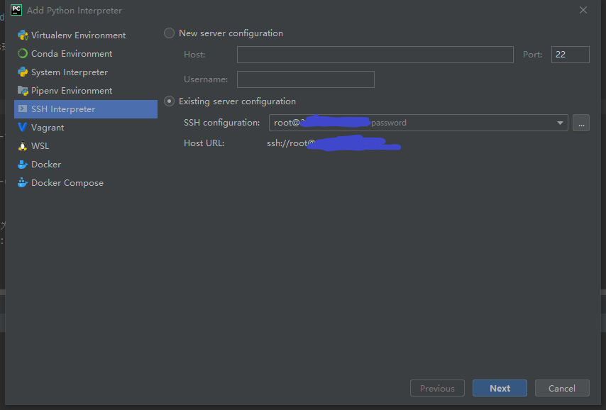
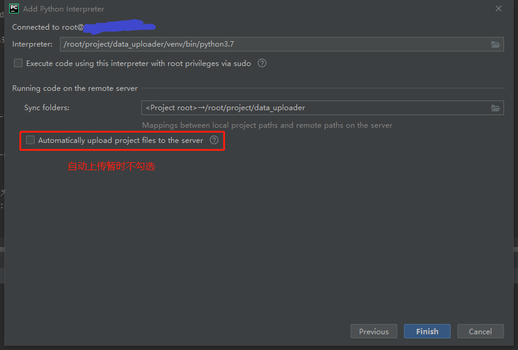
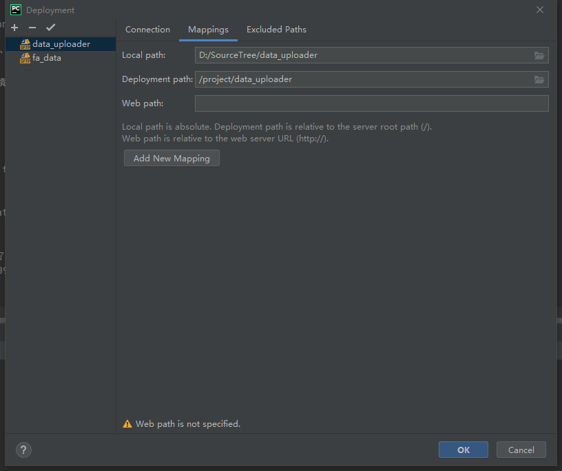
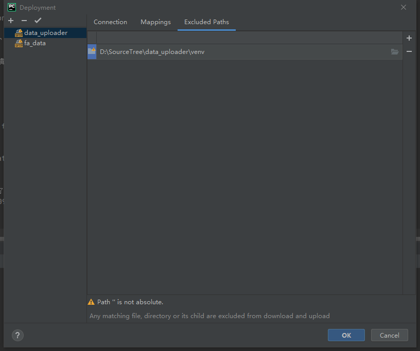

## **`Pycharm ssh远程访问服务器`**

### 1. 在远程服务器新增目标目录, 并建立虚拟环境
### 2. 新增远程解释器

### 3. 配置项目使用的远程解释器和同步目录. 但是暂不勾选自动同步

### 4. Tools -> Deployment -> Configuration
### 5. 如图加入配置

### 6. 右键本地项目目录 -> Deployment -> Upload to <project_name>